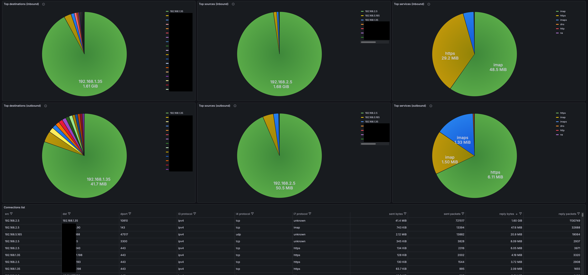

# conntrack-exporter

Prometheus exporter that reads the current Linux connection tracking table from `/proc/net/nf_conntrack`
and exports traffic metrics (packets/bytes) plus aggregated totals.

The exporter periodically takes a snapshot of `nf_conntrack` and **caches** the resulting metrics until
the next read.

## How it works

- Data source: `/proc/net/nf_conntrack`.
- Polling interval is controlled by `--collector.interval` (seconds).
- On each refresh the exporter **recreates** the per-connection metric set (old label pairs are deleted).
- Connections are **aggregated** by the key:
  - `src ip`, `dst ip`, `l3protocol`, `l4protocol`, `dport`, `l7protocol`
  - **source port is NOT part of the key**, so entries with the same `src/dst/dport` but different source ports are summed.

## Grafana dashboard

You can add grafana dashboard to visualize the exporter data. The dashboard code is in the file `grafana/conntrack-exporter.json`.



## Running (binary)

By default the exporter listens on `:9095` and serves metrics at `/metrics`.

Example:

```bash
./conntrack-exporter \
  --collector.interval=60 \
  --web.listen-address=:9095 \
  --web.telemetry-path=/metrics \
  --log.level=info \
  --log.format=logfmt
```

## Configuration (CLI flags)

Supported flags:

- `-h`, `--help`: show help and exit.
- `-v`, `--version`: show version and exit.
- `--collector.interval=60`: snapshot refresh interval, seconds.
- `--configure.nf_conntrack_acct`: try to set `net.netfilter.nf_conntrack_acct=1` at startup.
- `--path.procfs="/proc"`: procfs mount point (useful for containers/testing).
- `--web.telemetry-path="/metrics"`: HTTP path for metrics.
- `--web.disable-exporter-metrics`: exclude exporter metrics (`promhttp_*`, `process_*`, `go_*`).
- `--web.max-requests=40`: max parallel requests to `/metrics` (0 disables the limit).
- `--web.listen-address=:9095`: address(es) to listen on (repeatable).
- `--log.level=info`: log level (`debug|info|warn|error`).
- `--log.format=logfmt`: log format (`logfmt|json`).

## Required system configuration (sysctl)

For the kernel to include `packets`/`bytes` counters in `/proc/net/nf_conntrack`, you must enable:

- `net.netfilter.nf_conntrack_acct=1`

If the value is `0`, the exporter will still run, but conntrack entries may miss `packets/bytes` fields
or provide zero values (making traffic metrics incorrect).

Check the current value:

```bash
sysctl net.netfilter.nf_conntrack_acct
```

Enable until reboot:

```bash
sudo sysctl -w net.netfilter.nf_conntrack_acct=1
```

Make it persistent (example):

```bash
echo 'net.netfilter.nf_conntrack_acct=1' | sudo tee /etc/sysctl.d/99-conntrack-exporter.conf
sudo sysctl --system
```

The exporter also supports best-effort auto-configuration on startup:

- `--configure.nf_conntrack_acct`

Note: this typically requires `root` privileges (or equivalent capabilities), otherwise a warning will be logged.

## Running in Docker

In containers there are two important points:

- The exporter reads `nf_conntrack` from procfs. To read the **host** conntrack table, you must **mount the host `/proc`**
  into the container and point `--path.procfs` to that mount point.
- If the container runs in its own network namespace, you will see **container** conntrack, not the host's.
  For host metrics, use the host network namespace.

Run example (replace the image name with yours):

```bash
docker run --rm \
  --name conntrack-exporter \
  --net=host \
  --pid=host \
  -v /proc:/host/proc:ro \
  conntrack-exporter:latest \
  --path.procfs=/host/proc \
  --web.listen-address=:9095 \
  --web.telemetry-path=/metrics
```


## Building the binary

Requirements:

- Go **1.25**

Build via Makefile (outputs to `.artifacts/conntrack-exporter`):

```bash
make build
```

Or build directly with `go`:

```bash
cd src
go build -trimpath -ldflags="-s -w -X main.version=dev" -o ../.artifacts/conntrack-exporter ./cmd/conntrack-exporter
```

## Metrics

Per-connection metrics (actually per *aggregated conntrack key*, see “How it works”):

- `conntrack_sent_packets`
- `conntrack_sent_bytes`
- `conntrack_reply_packets`
- `conntrack_reply_bytes`

Totals (recomputed on each snapshot refresh, **without labels**):

- `conntrack_total_connections`
- `conntrack_total_sent_packets`
- `conntrack_total_sent_bytes`
- `conntrack_total_reply_packets`
- `conntrack_total_reply_bytes`

### Labels for per-connection metrics

The label set is fixed:

- `src`: source IP address
- `dst`: destination IP address
- `l3protocol`: `ipv4` or `ipv6`
- `l4protocol`: `tcp`, `udp`, `icmp`, ...
- `dport`: destination port
- `l7protocol`: well-known destination port name (e.g. `443=https`), otherwise `unknown`

For protocols without ports (e.g. `icmp`) the exporter uses:

- `dport="0"`
- `l7protocol="na"`

Example metric line:

```text
conntrack_sent_bytes{src="10.0.0.10",dst="93.184.216.34",l3protocol="ipv4",l4protocol="tcp",l7protocol="https",dport="443"} 12345
```

## systemd service example

Example unit file: `/etc/systemd/system/conntrack-exporter.service`.
Note: reading `/proc/net/nf_conntrack` and/or configuring sysctl typically requires `root`.

```ini
[Unit]
Description=Prometheus conntrack exporter
After=network-online.target
Wants=network-online.target

[Service]
Type=simple
ExecStart=/usr/local/bin/conntrack-exporter \
  --collector.interval=60 \
  --web.listen-address=:9095 \
  --web.telemetry-path=/metrics \
  --log.level=info \
  --log.format=logfmt

# If you want the exporter to try enabling packets/bytes accounting at startup:
# ExecStart=/usr/local/bin/conntrack-exporter --configure.nf_conntrack_acct ...

Restart=on-failure
RestartSec=3

# Minimal baseline hardening (kept conservative).
NoNewPrivileges=true
PrivateTmp=true
ProtectHome=true
ProtectKernelTunables=false
ProtectKernelModules=true
ProtectControlGroups=true

[Install]
WantedBy=multi-user.target
```

Apply:

```bash
sudo systemctl daemon-reload
sudo systemctl enable --now conntrack-exporter
sudo systemctl status conntrack-exporter
```


